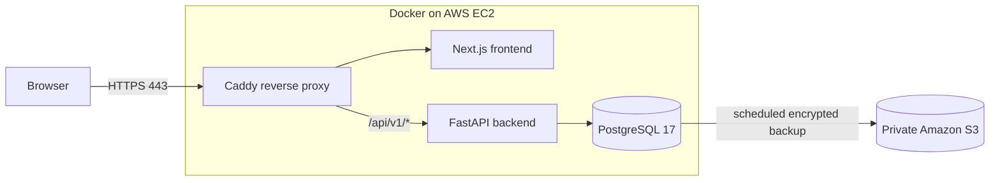

# StationStock

StationStock is an inventory and restocking application designed for a local gas station. It is built around a real manual inventory workflow: employees count what is on the shelf, managers maintain the catalog, and submitted counts drive low-stock and reorder decisions.

This repository represents a production-style pilot. It does not claim active daily use, measured adoption, or business impact.

## What it does

- Supports manager and employee roles with backend-enforced authorization.
- Lets employees save inventory-count drafts without changing official inventory.
- Makes a submitted count immutable and uses it as the latest official quantity.
- Flags counted products below their minimum and recommends `max(target - current, 0)` for reorder.
- Treats products with no submitted count as **Uncounted**, not as zero stock.
- Provides manager workflows for users, products, categories, and vendors.
- Uses short-lived authentication in Secure, HTTP-only cookies; tokens are never stored in browser storage.

## Architecture



The pilot uses one encrypted-EBS EC2 instance to keep cost and operational complexity low. Only HTTP/HTTPS are public; SSH and PostgreSQL are not exposed. Caddy manages TLS, systemd restarts the Compose stack after reboot, and scheduled PostgreSQL backups upload to a private, versioned S3 bucket. See [AWS deployment](AWS_DEPLOYMENT.md), [security](SECURITY.md), and [backup and restore](BACKUP_AND_RESTORE.md).

## Technology

- Next.js 16, React 19, strict TypeScript, Tailwind CSS, React Hook Form, and Zod
- FastAPI, SQLAlchemy, Alembic, Pydantic, and Argon2 password hashing
- PostgreSQL 17
- Docker Compose, Caddy, AWS EC2, encrypted EBS, Systems Manager, and S3

## Engineering decisions

- **PostgreSQL:** relational constraints and transactions fit users, catalog records, count sessions, and immutable count history.
- **Draft isolation:** draft quantities are incomplete work. Official inventory changes only when a count is deliberately submitted.
- **Backend authorization:** hiding navigation improves usability but is not a security boundary, so every privileged API operation checks the authenticated role.
- **Single EC2 pilot:** one host is inexpensive and understandable initially. The tradeoff is a single failure domain and hands-on database operations.
- **Migration path:** the containers can move to Railway, PostgreSQL can move to RDS, or the services can move to ECS when availability and scale justify the added cost.

## Local development

Requirements: Docker Desktop (or Docker Engine with Compose) and Node.js 24 LTS for direct frontend work.

```sh
docker compose up --build
docker compose exec backend python -m app.scripts.seed_demo_data
```

The seed command is explicit, development-only, and rejected when `ENVIRONMENT=production`. Development credentials and synthetic data are documented in [the demo guide](DEMO_GUIDE.md); never use them with a production database.

For direct `npm run dev` frontend work, copy `frontend/.env.example` to the ignored `frontend/.env.local`. The optional demo credential panel renders only in the Next.js development server; optimized production builds remove it.

Quality checks:

```sh
python -m pytest backend/tests
cd frontend
npm test
npm run lint
npm run typecheck
npm run build
```

## Testing and production safeguards

The automated suites cover authentication, inactive-user rejection, role authorization, password/session invalidation, catalog operations, draft ownership, submission immutability, inventory calculations, production configuration, and seed rejection. Production disables API docs, restricts credentialed CORS to the deployed HTTPS origin, generates secrets outside Git, and starts with migrations only—no users or demo data.

Deployment evidence and dated results are kept in [the validation report](VALIDATION_REPORT.md). Browser acceptance items are tracked in [the manual checklist](MANUAL_ACCEPTANCE_CHECKLIST.md).

## Screenshots

Screenshots are intentionally not fabricated. The deployed pilot currently has no manager or store data, so authenticated screens cannot be captured safely yet. See the [sanitized screenshot checklist](docs/SCREENSHOTS.md); approved images will live in `docs/images/`.

## Known limitations

- The single EC2 host and local PostgreSQL volume are a single failure domain.
- Login throttling is process-local rather than shared across replicas.
- Quantities are whole numbers, and catalog selectors load the first 100 active records.
- CSV import, barcode scanning, delivery reconciliation, expiration tracking, offline mode, and an audit-log frontend are not implemented.
- Automated browser end-to-end and responsive visual-regression tests are not configured.

## What I would build next

- Atomic CSV import with dry-run validation
- Barcode-assisted counting
- Delivery and purchase-order reconciliation
- Lot and expiration tracking
- Manager-facing audit-log views
- Managed PostgreSQL with tested point-in-time recovery
- Shared rate limiting for horizontal scaling

## Additional documentation

- [Architecture details](ARCHITECTURE.md)
- [API contract](frontend/API_CONTRACT.md)
- [Store onboarding](STORE_ONBOARDING.md)
- [Security model](SECURITY.md)
- [Backup and restore](BACKUP_AND_RESTORE.md)
- [Project scope](PROJECT_PLAN.md)
