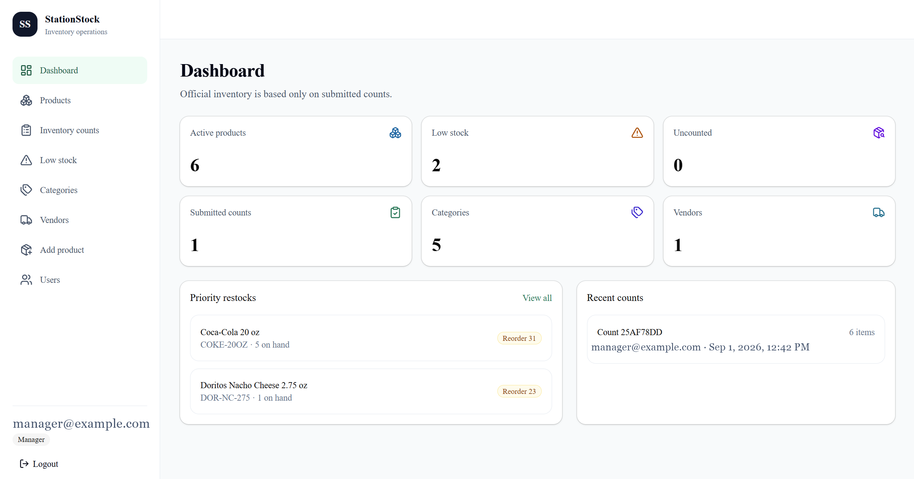
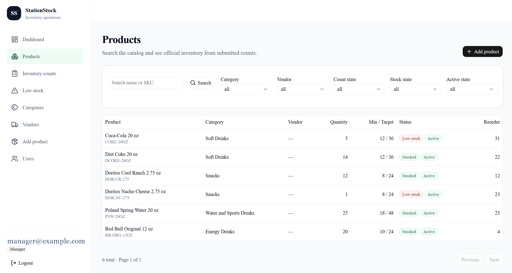
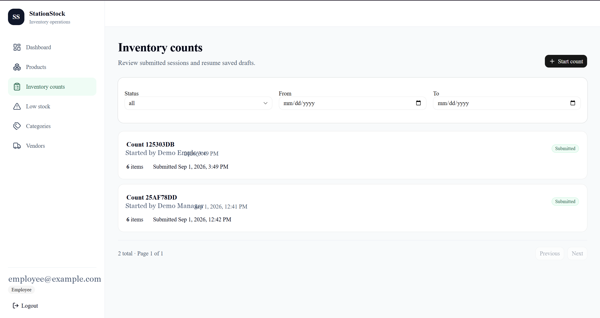
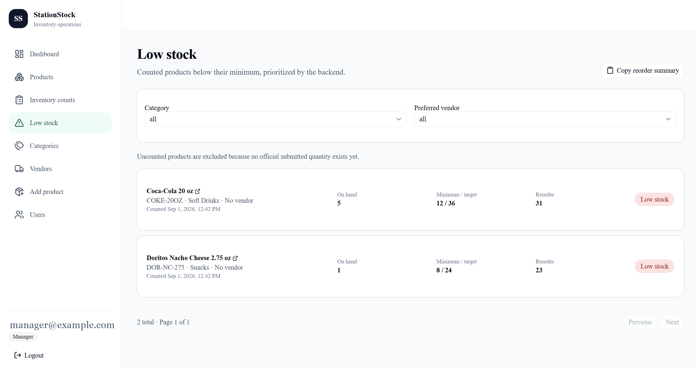
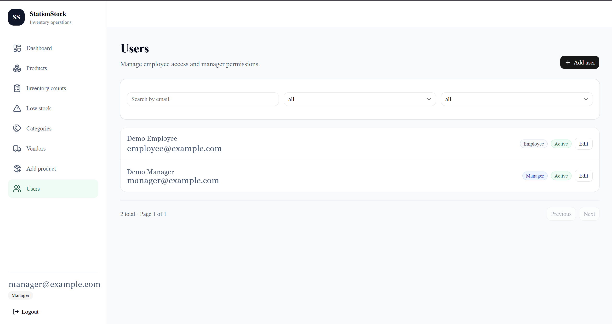

# Application screenshots

The screenshots below use portfolio data and have been sanitized to remove personal email addresses.

## Dashboard

## Products

## Inventory counts

## Low stock

## User management

## Remaining screenshot checklist

- [ ] Login page after confirming no demo credentials appear
- [ ] Dashboard at a narrow mobile width
- [ ] Inventory-count draft, save, and submission confirmation
- [ ] Browser storage view confirming no token in local or session storage
- [ ] Network response showing a Secure, HTTP-only cookie without exposing its value

Every screenshot must exclude real employee emails, store-sensitive inventory, AWS account or resource identifiers, public IP addresses, tokens, secrets, passwords, certificates, and local machine paths. Crop browser chrome or bookmarks that disclose personal information.
